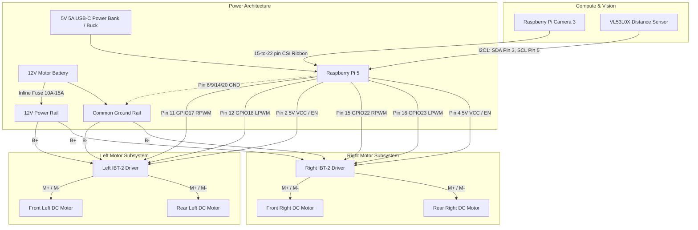

# Rover Electrical & Circuit Documentation

This directory contains wiring schematics, pinout references, and electrical diagrams for the **Raspberry Pi 5 AI Rover**.

## Documentation Index

| Document | Description | Format |
| :--- | :--- | :--- |
| **[gpio_pinout.md](gpio_pinout.md)** | Full Raspberry Pi 5 40-pin GPIO mapping, physical pin numbers, and pin allocations. | ASCII / Markdown Table |
| **[motor_driver_wiring.md](motor_driver_wiring.md)** | Detailed wiring for dual IBT-2 (BTS7960) motor drivers, 4 DC motors, and logic pins. | ASCII & Mermaid |
| **[sensors_and_camera.md](sensors_and_camera.md)** | Pi Camera 3 CSI ribbon interface and VL53L0X Time-of-Flight I2C connection diagram. | ASCII & Mermaid |
| **[power_distribution.md](power_distribution.md)** | Dual-rail power architecture, battery connections, common ground rule, and fuse protection. | ASCII & Mermaid |

---

## High-Level Electrical Safety Rules

> [!CAUTION]
> **1. Common Ground Rule**
> The **negative terminal** of the 12V motor battery and the **GND pins** of the Raspberry Pi 5 **MUST** be connected together. Without a shared common reference ground, the PWM signals cannot complete their electrical circuit, resulting in erratic, uncontrolled motor spins.

> [!WARNING]
> **2. Never Power Motors from the Raspberry Pi**
> The Raspberry Pi's 5V and 3.3V header pins are designed strictly for low-power logic and sensors. Connecting DC motors directly to the Pi's power rails will cause voltage drops, SD card corruption, and permanent silicon damage. Motors must always be powered from a dedicated external battery (e.g. 12V Li-ion or LiFePO4).

> [!IMPORTANT]
> **3. Over-Current Fuse Protection**
> The IBT-2 driver can deliver high peak current (up to 43A stall). Always place an inline automotive fuse (10A to 15A recommended for standard 12V geared DC motors) on the positive lead of the motor battery.

---

## High-Level System Architecture Diagram

