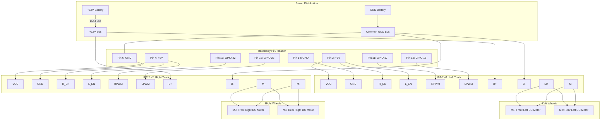

# IBT-2 (BTS7960) Dual Motor Driver Wiring

This document specifies the wiring between the **Raspberry Pi 5**, the **two IBT-2 (BTS7960) H-bridge motor drivers**, and the **four DC geared motors**.

---

## IBT-2 Board Overview & Pinout

Each IBT-2 module features:
1. **An 8-pin logic control connector** (0.1" pitch header pins).
2. **A 4-position high-current screw terminal block** (for motor power and motor outputs).

### 8-Pin Logic Header

| Pin Label | Function | Connection on Rover |
| :--- | :--- | :--- |
| **RPWM** | Forward PWM input | Connects to Pi GPIO (controls forward speed via duty cycle). |
| **LPWM** | Reverse PWM input | Connects to Pi GPIO (controls reverse speed via duty cycle). |
| **R_EN** | Forward Enable (Active High) | Tied to **+5V** (keeps forward drive permanently enabled). |
| **L_EN** | Reverse Enable (Active High) | Tied to **+5V** (keeps reverse drive permanently enabled). |
| **R_IS** | Forward Current Alarm / Sense | Left **Unconnected** (optional analog current feedback). |
| **L_IS** | Reverse Current Alarm / Sense | Left **Unconnected** (optional analog current feedback). |
| **VCC** | Logic Power Input (+5V) | Connected to Raspberry Pi **5V Power** (Pin 2 or Pin 4). |
| **GND** | Logic Ground | Connected to Raspberry Pi **Ground** (Pin 6, 14, or 20). |

### 4-Position Screw Terminals

| Terminal Label | Function | Connected To |
| :--- | :--- | :--- |
| **B+** | Motor Power (+6V to +27V) | 12V Battery Positive (through inline 10A-15A fuse). |
| **B-** | Motor Power Ground | 12V Battery Negative AND Raspberry Pi GND. |
| **M+ / OUT1** | Motor Output (+) | Left Side (M1+M2) or Right Side (M3+M4) red wires. |
| **M- / OUT2** | Motor Output (-) | Left Side (M1+M2) or Right Side (M3+M4) black wires. |

---

## Complete Wiring Schematic (Mermaid)



---

## Detailed ASCII Wiring Diagram

```text
                  +----------------------------------------------+
                  |         Raspberry Pi 5 40-Pin Header         |
                  |                                              |
                  |  [Pin 2]  5V -------------------+            |
                  |  [Pin 4]  5V -----------+       |            |
                  |  [Pin 6]  GND --------- | ----- | --------+  |
                  |  [Pin 14] GND ----+     |       |         |  |
                  |  [Pin 11] GPIO17 -| - - | - - - | - - - + |  |
                  |  [Pin 12] GPIO18 -| - - | - - - | - - + | |  |
                  |  [Pin 15] GPIO22 -| - - | - - + |     | | |  |
                  |  [Pin 16] GPIO23 -| - - | - + | |     | | |  |
                  +-------------------|-----|---|---|-|-|-|-|-|--+
                                      |     |   | | | | | | | |
      +-------------------------------+     |   | | | | | | | |
      |   +---------------------------------+   | | | | | | | |
      |   |                                     | | | | | | | |
      |   |         LEFT DRIVER (IBT-2 #1)      | | | | | | | |
      |   |      +--------------------------+   | | | | | | | |
      |   +----> | VCC                      |   | | | | | | | |
      |   +----> | R_EN (Tied to 5V)        |   | | | | | | | |
      |   +----> | L_EN (Tied to 5V)        |   | | | | | | | |
      +--------> | GND                      |   | | | | | | | |
                 | RPWM <-------------------|---|---|-+ | | | |
                 | LPWM <-------------------|---|---|---+ | | |
                 | R_IS (N/C)               |   | | |     | | |
                 | L_IS (N/C)               |   | | |     | | |
                 |                          |   | | |     | | |
     +12V Bat -> | B+                       |   | | |     | | |
     Bat GND --> | B-                       |   | | |     | | |
                 |                          |   | | |     | | |
                 | M+ -----> M1(+) & M2(+)  |   | | |     | | |
                 | M- -----> M1(-) & M2(-)  |   | | |     | | |
                 +--------------------------+   | | |     | | |
                                                | | |     | | |
                    RIGHT DRIVER (IBT-2 #2)     | | |     | | |
                 +--------------------------+   | | |     | | |
                 | VCC <------------------------+ | |     | | |
                 | R_EN <-----------------------+ | |     | | |
                 | L_EN <-----------------------+ | |     | | |
                 | GND <--------------------------|-------+ | |
                 | RPWM <-------------------------|-+       | |
                 | LPWM <-------------------------+         | |
                 | R_IS (N/C)               |               | |
                 | L_IS (N/C)               |               | |
                 |                          |               | |
     +12V Bat -> | B+                       |               | |
     Bat GND --> | B-                       |               | |
                 |                          |               | |
                 | M+ -----> M3(+) & M4(+)  |               | |
                 | M- -----> M3(-) & M4(-)  |               | |
                 +--------------------------+               | |
                                                            | |
     COMMON GROUND: 12V Battery Negative <-----------------+--+
```

---

## Motor Polarity Calibration

When the Rover is placed on blocks (wheels elevated) and the web interface command **Forward** is issued:
- Both left wheels (`M1`, `M2`) must spin forward.
- Both right wheels (`M3`, `M4`) must spin forward.

If any motor rotates backward:
1. Turn off motor battery power.
2. Swap the two terminal wires (`M+` and `M-`) of that specific motor.
3. Power back on and re-verify.
