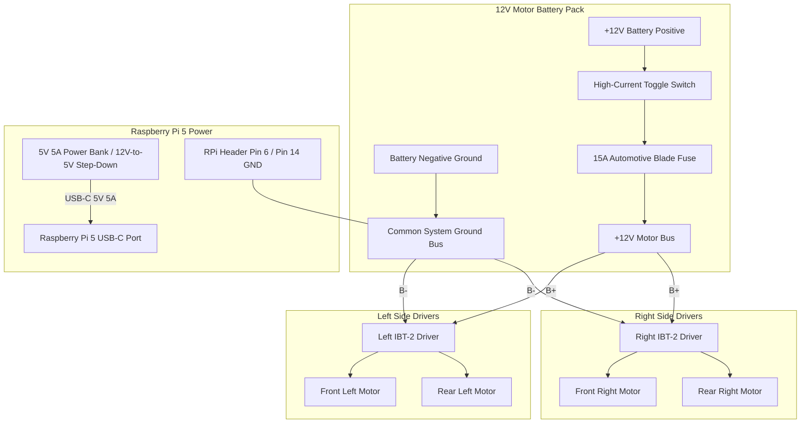

# Rover Power Distribution & Dual-Rail Architecture

This document outlines the electrical power supply design for the **Raspberry Pi 5 AI Rover**.

---

## 1. Dual-Rail Power Philosophy

To ensure reliable operation without sudden brownouts, system reboots, or SD card corruption, the rover uses **two electrically isolated power rails sharing a single common ground reference**:

1. **High-Current Motor Rail (12V DC):**
   - Supplies power to the dual IBT-2 motor drivers and the four DC geared motors.
   - Handles large inductive current spikes (up to 10A–20A during stall or rapid reversals).
   - Powered by a dedicated 12V Li-ion, LiFePO4, or 3S LiPo battery pack.

2. **Clean Logic Rail (5V 5A DC):**
   - Supplies regulated power to the Raspberry Pi 5 (which requires 5V at up to 5A for full USB-PD performance, CPU turbo, and camera streaming).
   - Powered by an official Raspberry Pi 27W USB-C supply (bench testing) or an onboard high-efficiency 5V 5A synchronous buck converter / power bank (field operation).

---

## 2. Power Architecture Diagram (Mermaid)



---

## 3. Power Distribution ASCII Schematic

```text
       +--------------------+
       |  12V MOTOR BATTERY |
       +--------------------+
         (+)              (-)
          |                |
     [15A Fuse]            |
          |                |
     [Main Switch]         |
          |                |
   +------+------+         |
   |             |         |
   | (+12V Bus)  |         +-----------------------+
   |             |                                 |
   v             v                                 |
+------+      +------+                             |
| IBT2 |      | IBT2 |                             |
| #1   |      | #2   |                             |
| (L)  |      | (R)  |                             |
|      |      |      |                             |
|  B+  |      |  B+  |                             |
|  B-  |      |  B-  |                             |
+---+--+      +---+--+                             |
    |             |                                |
    +-------------+--------------------------------+
                  |
                  |  (COMMON GROUND BUS)
                  |
                  +<=======> Connected to Raspberry Pi 5 Header Pin 6 / 14 (GND)


       +--------------------+
       | 5V 5A LOGIC POWER  |
       |  (USB-C Battery)   |
       +--------------------+
                 |
                 +-----> USB-C Port on Raspberry Pi 5
```

---

## 4. Key Rules & Calculations

### Why Common Ground is Mandatory
Control signals from Raspberry Pi GPIO pins (RPWM, LPWM) are 3.3V logic voltage pulses measured relative to the Raspberry Pi's 0V GND reference. The IBT-2 driver logic inputs must evaluate this voltage relative to their own GND pin. If the motor battery negative and Pi ground are not bridged, floating voltage occurs, causing motors to twitch, spin erratically, or fail to respond.

### Recommended Wire Gauges
- **12V Motor Power Bus (Battery to IBT-2 B+ and B-):** 14 AWG or 16 AWG stranded silicone wire.
- **Motor Output Wires (IBT-2 M+/M- to DC Motors):** 16 AWG or 18 AWG.
- **Logic & Signal Wires (Pi GPIO to IBT-2 header):** 22 AWG or 24 AWG jumper wires.
- **Common Ground Jumper (Pi GND to Battery Negative):** 20 AWG or 22 AWG.
