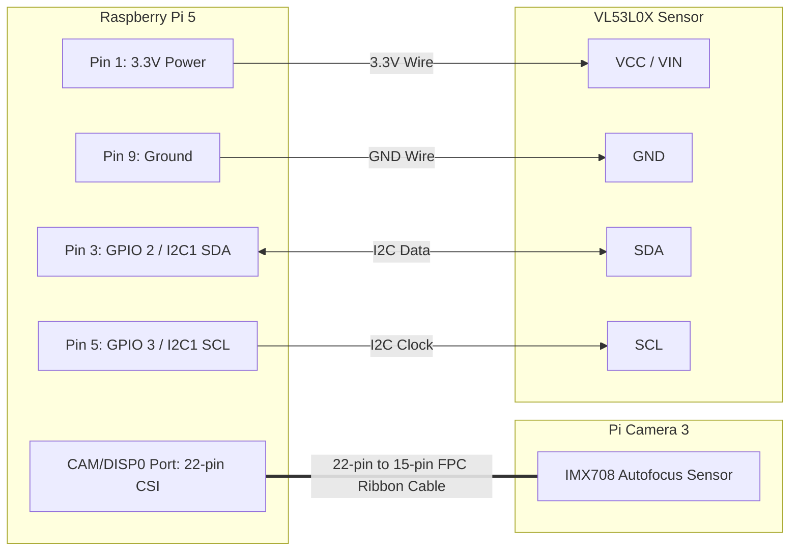

# Sensors and Camera Hardware Connections

This document details the interface wiring for the **Raspberry Pi Camera 3** and the **VL53L0X Time-of-Flight (ToF)** distance sensor.

---

## 1. Raspberry Pi Camera 3 Interface

The Raspberry Pi 5 replaces the legacy 15-pin CSI connector with **two 22-pin 0.5mm pitch MIPI CSI/DSI ports** labelled `CAM/DISP0` and `CAM/DISP1`.

### Cable Specification
* **Type:** 15-pin (standard camera side) to 22-pin 0.5mm pitch (Pi 5 side) FPC ribbon cable.
* **Port on Pi 5:** Connect to `CAM/DISP0` (or `CAM/DISP1`).
* **Orientation:**
  - **Pi 5 end:** Contacts face down toward the motherboard PCB.
  - **Camera 3 end:** Contacts face toward the back of the camera circuit board.

### Verification Command
Once connected, test detection using `libcamera`:
```bash
rpicam-hello --list-cameras
```
Expected output:
```text
Available cameras
0 : imx708 [4608x2592] (/base/axi/pcie@120000/rp1/i2c@88000/imx708@1a)
    Modes: 'SRGGB10_CSI2P' : 1536x864 [120.13 fps - (768, 432)/3072x1728 crop]
                             2304x1296 [56.03 fps - (0, 0)/4608x2592 crop]
                             4608x2592 [14.35 fps - (0, 0)/4608x2592 crop]
```

---

## 2. VL53L0X Time-of-Flight Sensor (I2C)

The VL53L0X measures target distances up to 2 meters using infrared laser time-of-flight. It communicates with the Raspberry Pi 5 over the **I2C1 bus**.

### Pinout Table

| VL53L0X Pin | Description | RPi 5 Physical Pin | RPi 5 Function |
| :--- | :--- | :---: | :--- |
| **VCC / VIN** | Power Input (3.3V or 5V) | **Pin 1** | **3.3V DC Power** |
| **GND** | Ground | **Pin 9** | **Ground** |
| **SCL** | I2C Clock | **Pin 5** | **GPIO 3 (SCL1)** |
| **SDA** | I2C Data | **Pin 3** | **GPIO 2 (SDA1)** |
| **XSHUT** | Hardware Shutdown (Active LOW) | *Optional* | Can tie to Pin 18 (GPIO 24) or leave floating |
| **GPIO1** | Programmable Interrupt Output | *Optional* | Unconnected for basic distance polling |

---

## Schematic Diagram (Mermaid)



---

## Visual ASCII Wiring

```text
Raspberry Pi 5 Header                        VL53L0X Breakout
+-----------------------------+              +-----------------+
|  [Pin 1] 3.3V Power --------|------------> | VCC / VIN       |
|  [Pin 3] GPIO 2 (SDA1) <----|------------> | SDA             |
|  [Pin 5] GPIO 3 (SCL1) -----|------------> | SCL             |
|  [Pin 9] Ground ------------|------------> | GND             |
+-----------------------------+              | XSHUT (N/C)     |
                                             | GPIO1 (N/C)     |
                                             +-----------------+

Raspberry Pi 5 MIPI Port                     Pi Camera 3 Module
+-----------------------------+              +-----------------+
| [CAM/DISP0] 22-pin CSI =====|============> | 15-pin FPC Port |
+-----------------------------+              +-----------------+
```

---

## Enabling and Testing I2C on Raspberry Pi OS

1. Open Raspberry Pi configuration:
   ```bash
   sudo raspi-config
   ```
2. Navigate to: **Interface Options** -> **I2C** -> Enable -> **Finish**.

3. Install I2C diagnostic utilities:
   ```bash
   sudo apt install -y i2c-tools python3-smbus
   ```

4. Verify sensor presence on I2C bus 1:
   ```bash
   sudo i2cdetect -y 1
   ```
   Expected matrix showing `29` (the default 7-bit hex address for VL53L0X):
   ```text
        0  1  2  3  4  5  6  7  8  9  a  b  c  d  e  f
   00:                         -- -- -- -- -- -- -- --
   10: -- -- -- -- -- -- -- -- -- -- -- -- -- -- -- --
   20: -- -- -- -- -- -- -- -- -- 29 -- -- -- -- -- --
   30: -- -- -- -- -- -- -- -- -- -- -- -- -- -- -- --
   40: -- -- -- -- -- -- -- -- -- -- -- -- -- -- -- --
   50: -- -- -- -- -- -- -- -- -- -- -- -- -- -- -- --
   60: -- -- -- -- -- -- -- -- -- -- -- -- -- -- -- --
   70: -- -- -- -- -- -- -- --
   ```
